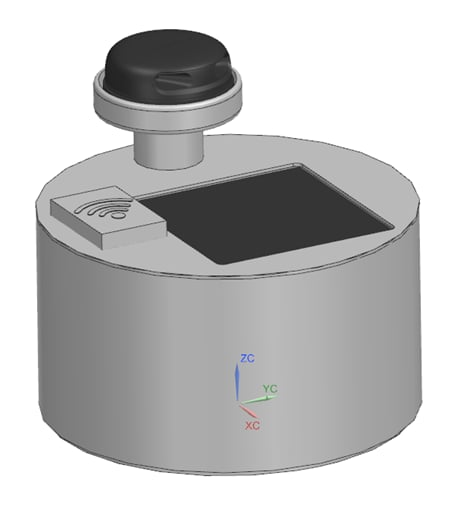
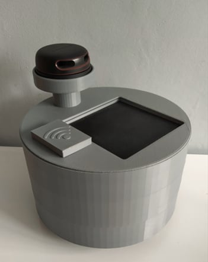
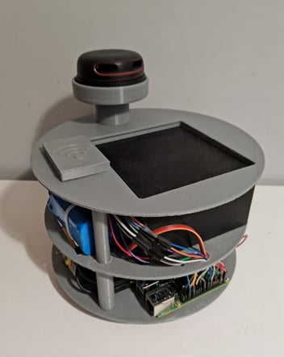
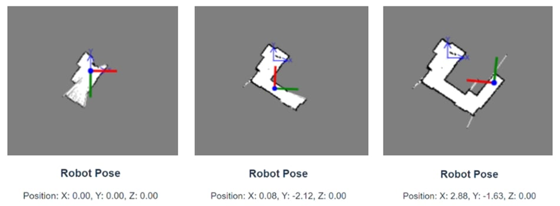
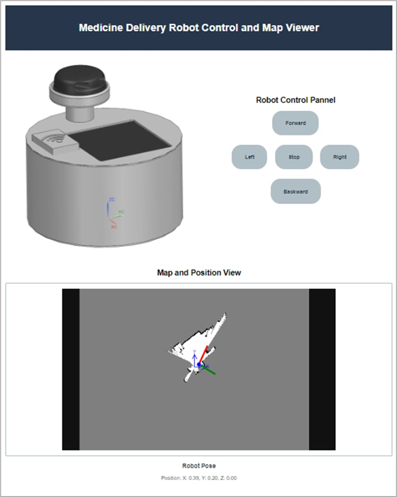
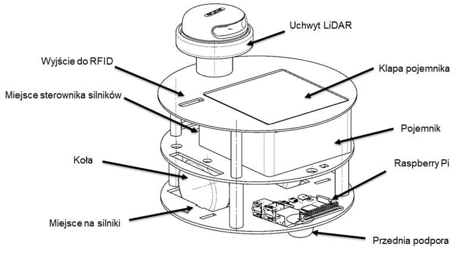
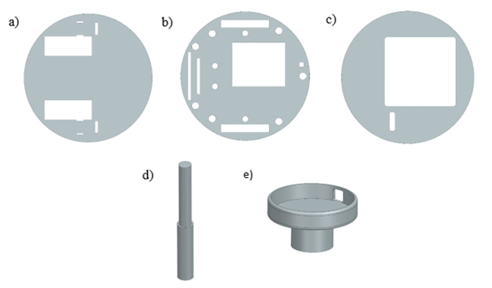
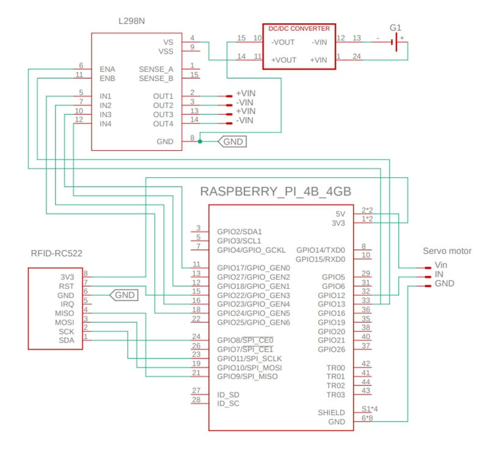

# Platforma mobilna do wydawania lekarstw w środowisku szpitalnym

Projekt inżynierski przedstawia zaprojektowanie i wykonanie mobilnej platformy robotycznej z dedykowanym modułem wydawania lekarstw, przeznaczonej do pracy w środowisku szpitalnym. Głównym celem projektu jest automatyzacja procesu transportu i dystrybucji leków w sposób bezpieczny, niezawodny i zdalnie kontrolowany.

  

  

  

Przebieg projektu:

  

## Funkcjonalności

- Autonomiczna nawigacja z wykorzystaniem systemu ROS oraz algorytmu Hector SLAM
  

  

- Moduł przechowywania i wydawania lekarstw z zabezpieczeniem RFID
- Interfejs webowy umożliwiający zdalne sterowanie i podgląd statusu robota

  

- Wydzielony system zasilania dla jednostki sterującej i napędu
- Wysoka precyzja mapowania i lokalizacji dzięki sensorowi LiDAR

## Komponenty sprzętowe

- **Raspberry Pi 4B** – główna jednostka obliczeniowa
- **RPLIDAR A2M8** – czujnik do skanowania otoczenia
- **Sterownik L298N** – kontrola silników
- **Silniki SJ01 z przekładnią 120:1** – napęd kołowy
- **Czytnik RFID RC522** – kontrola dostępu do modułu lekarstw
- **Serwomechanizm 3601HB** – sterowanie klapą modułu
- **Zasilanie** – Powerbank 20 000 mAh (Raspberry Pi) i akumulator Li-ion 12 000 mAh (silniki)

  

  

## Schemat elektryczny

  

## Oprogramowanie

- **ROS (Robot Operating System)** – środowisko robotyczne
- **Hector SLAM** – algorytm lokalizacji i mapowania
- **rplidar_ros** – integracja sensora LiDAR z ROS
- **WebSocket + JavaScript** – komunikacja między interfejsem a robotem
- **Python** – logika sterowania robotem (m.in. `motor_control.py`)
- **HTML/CSS** – interfejs użytkownika

## Uruchomienie

1. Zainstaluj ROS na Raspberry Pi 4 i skonfiguruj środowisko
2. Podłącz komponenty (LiDAR, RFID, silniki, zasilanie)
3. Skonfiguruj i uruchom pakiety `rplidar_ros` i `hector_slam`
4. Otwórz `index.html` w przeglądarce i połącz się z robotem przez WebSocket
5. Testuj i monitoruj działanie z poziomu interfejsu
